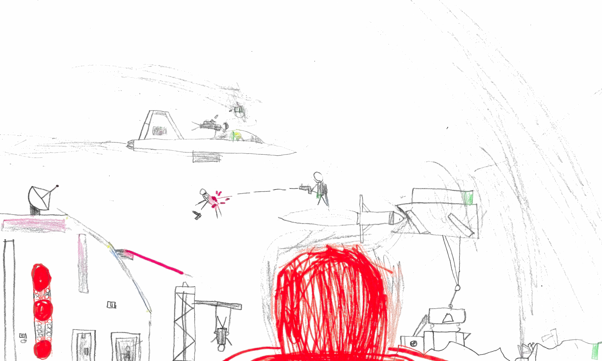

# Tomato Kingdom vs. Lettuce Kingdom

An animated storybook built from six pencil-and-marker drawings by **William**, and the war story he told to go with them.

Open `index.html` in a browser. No build step, no dependencies — one self-contained HTML file.



## What's in here

```
index.html                  the whole storybook — SVG art, CSS animation, Web Audio sound
art/scans/                  the six original drawings, each stitched from two scanner passes
art/enhanced/               contrast-recovered versions (faint pencil brought back)
docs/story.md               the script, in William's telling
docs/art-review.md          the drawing/animation review the redraw was built from
tools/                      the Python used to stitch and enhance the scans
```

## The storybook

Five scenes, in the order William put them in — drawing **04 → 05 → 06 → 03 → 02** (drawing 01 was set aside).

| Scene | Drawing | What happens |
|---|---|---|
| 1 · Two Kingdoms, One Sky | 04 | A drone drops a sniper; he shoots a paratrooper's chute |
| 2 · First Missile | 05 | The Tomato silo topples the Lettuce base; a jet missile kills the helicopter |
| 3 · The Counterstrike | 06 | The Lettuce missile smashes the Tomato roof guns |
| 4 · The Tomato Bomb | 03 | Tom is exposed as a spy; the King fires the Tomato Bomb |
| 5 · Shut It Down | 02 | Tom and Ryley rope into the underground nuclear base |

Left side is the Tomato Kingdom. Right side is the Lettuce Kingdom. Tom only ever shoots at walls — there is a reason for that, and it comes out in scene 4.

### Two screens for recording

The page has a **Script** view and a full-screen **Stage** view. Open the same file in two windows, put one in Stage mode (`index.html#stage`), and they stay in sync through `localStorage` — one screen to read from, one to film.

### Other controls

- **ORIGINAL / CARTOON** — flip any scene between William's drawing and the redraw
- **SOUND** — synthesised ambience, gunfire, explosions, alarms (Web Audio, no audio files)
- Arrow keys / the dots move between scenes

## How the scans were fixed

Each sheet of paper was longer than the scanner bed, so every drawing arrived as two overlapping halves. `tools/pair_scans.py` and `tools/stitch_scans.py` pair them with SIFT features and a RANSAC affine fit, then blend at the middle of the overlap.

`tools/enhance.py` recovers the faint pencil: bilateral denoise → background flattening → an ink-density gamma curve → LAB chroma cleanup that keeps whole marker patches their real colour → unsharp mask. The ink mask comes from `min(R,G,B)` rather than luminance, so yellow survives.

## Credits

Story and original drawings by William. Digitisation, redraw and animation by his dad, with Claude.
